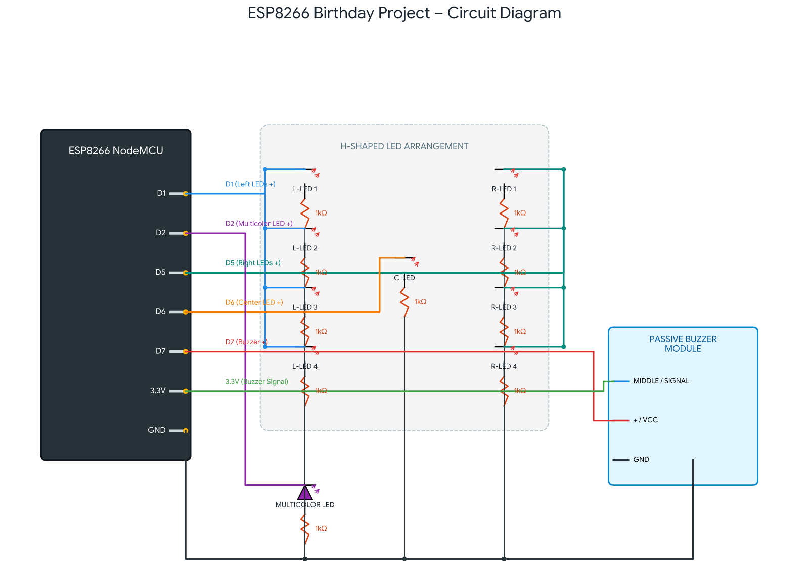

# 🎂 ESP8266 Birthday Project

An interactive birthday-themed electronics project built using an ESP8266 NodeMCU, multiple LEDs, a multicolor LED, and a passive buzzer module.

## 🔌 Circuit Diagram

## 🎥 Circuit Demonstration

[Watch the Circuit Demonstration](https://drive.google.com/file/d/1SHnBz4F_rSt6sIYvbl-ilHdfkpaoG00V/view?usp=sharing&utm_source=chatgpt.com)

## 🧰 Components Used

- ESP8266 NodeMCU
- LEDs
- Multicolor LED
- 1kΩ resistors
- Passive buzzer module
- Breadboard
- Jumper wires

## ⚙️ Pin Configuration

| Component | ESP8266 Pin |
|---|---|
| Left-side LEDs | D1 |
| Multicolor LED | D2 |
| Middle LED | D6 |
| Right-side LEDs | D5 |
| Passive buzzer | D7 |

## ✨ Features

- H-shaped LED arrangement
- Multicolor LED effect
- Buzzer output
- ESP8266-based control
- Simple interactive birthday display

## 👨‍💻 Author

**Zaheed Khan**

### 🛡️ Project Name

**Birthday Project**

---
